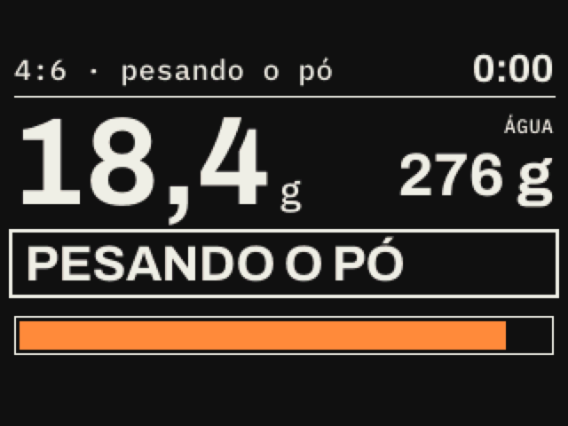
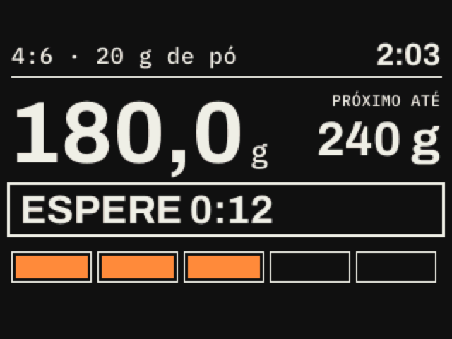
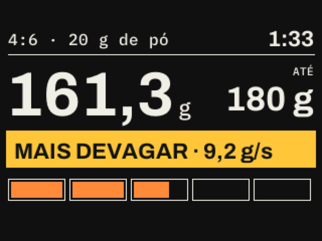
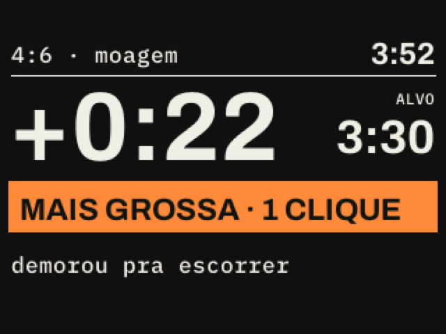

# smart-coffee-scale

A pour-over coffee scale that guides the brew from the scale itself: it builds the recipe from the taste you want, tells you when to pour and how much, and learns from the last cup. No phone needed.

> **Status: firmware running in simulation.** Weighing, calibration, the screen and the guided 4:6 brew run on an ESP32-S3 in the Wokwi simulator and are tested on every change. Next step is the first prototype on the bench, then the enclosure in Fusion, printed on a Bambu Lab P2S.

## Why

Scales like the Acaia Pearl S and Fellow Tally Pro already guide pours. What is still missing is building the recipe itself from a flavor profile (volume, sweeter or brighter, how many pours, Tetsu Kasuya's 4:6 logic) on the scale, offline, in Portuguese. Today that only lives in phone apps and web calculators.

## What it does

- **Wakes up and tares by itself** when the dripper goes on, weighs the coffee and sets the water to match (1:15, 20 g becomes 300 g)
- **Guided pours:** the screen says *pour up to X g*, counts the wait to the next pour, and beeps softly
- **Pace warning** when the flow goes past ~8 g/s
- **Automatic end** when the dripper comes off
- **Grind suggestion** from the total time (finished late: one click coarser)
- **Saved recipes** and on-device editing with two buttons
- **Modes:** recipe, free (weight, timer, live ratio) and tea (steep timer)
- **QR code** at the end with recipe and time, readable without Wi-Fi
- **Brew curves** kept in memory and synced to a companion app when it connects

## Hardware (planned)

| Part | Choice |
|---|---|
| MCU | ESP32-S3 (Wi-Fi + Bluetooth) |
| Load cell | 500 g + HX711, ±0.2 g |
| Display | 2.8" IPS, 320×240, tilted 10° into the body |
| Input | 2 capacitive touch buttons |
| Power | 800 mAh LiPo, USB-C charging |
| Sound | passive buzzer, low volume |
| Body | 116 × 152 × 21.5 mm, PETG |

Built on the shoulders of open projects: [WeighMyBru²](https://github.com/031devstudios/weighmybru2) as the technical base and the [Decent Open Scale](https://github.com/decentespresso/openscale) protocol for app compatibility.

## Screens

Rendered by the firmware itself, on the 2.8" 320 × 240 IPS layout.

| Weighing the coffee | Waiting for the next pour |
|---|---|
|  |  |
| **Pouring too fast** | **Grind advice at the end** |
|  |  |

## Roadmap

- [x] Market scan and concept
- [x] Screen layout and brew flow, simulated
- [x] Firmware: weighing, calibration, screen, guided 4:6 brew, end detection (in simulation)
- [ ] Bench prototype: load cell, display, buttons
- [ ] Recipe picker on the scale, beep, brew curve and QR
- [ ] Enclosure modeled in Fusion and printed
- [ ] Companion app sync
